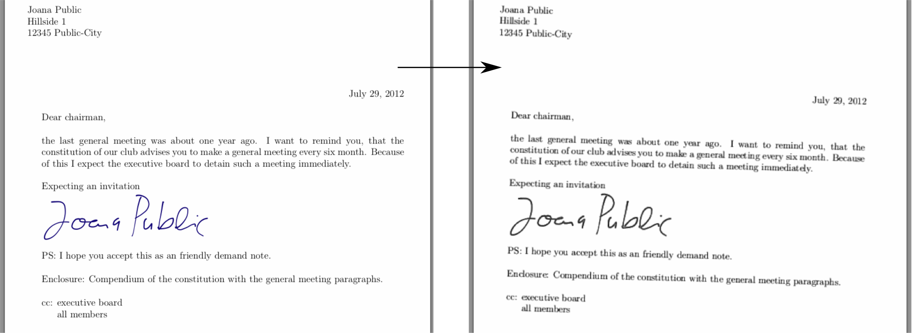

# Photocopy

Have you ever had to send in a signature, been annoyed about the process of printing a piece of paper to write your signature on it, only to immediately throw away the paper after scanning it, when you could just as well have written your signature in paint and sent the result, only it looks just a little bit too clean and forged that way? Then you've come to the right place!

Based on [this wonderfully silly StackExchange post](https://tex.stackexchange.com/a/94541/88992), this web app allows users to upload images and get back as a result the simulated scan of their input.

## Try it out

The app is currently hosted on https://photocopy.fuglede.dk/ where you can try it out yourself.
